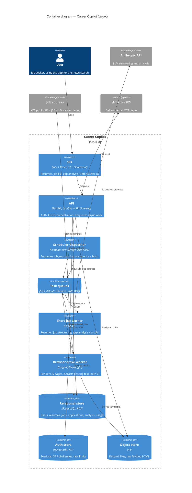

# Career Copilot

A job-search assistant: import job postings, analyse the gap between your work
history and each posting, and tailor your résumé per application.

Private project. Built for the developer's own job search first; see
`CLAUDE.local.md` for the product spec and `docs/development-plan.md` for the
roadmap.

## Architecture (target)



Rationale for the main choices lives in `docs/adr/`.

## Layout

| Path | What |
|---|---|
| `backend/` | FastAPI API **and** async worker handlers (one Python project) |
| `frontend/` | Vite + React SPA |
| `infra/terraform/` | AWS infrastructure (Terraform) — real modules land in Phase 10 |
| `infra/localstack/` | LocalStack root module for local AWS emulation |
| `scripts/` | dev/ops helpers |
| `docs/` | plan, ADRs, data model, development log, local/manual testing guides |

## Prerequisites

- [uv](https://docs.astral.sh/uv/) (Python 3.13)
- Node 24 (Active LTS) + pnpm (`corepack enable pnpm`)
- Docker (Postgres + LocalStack + MailHog)
- Terraform (for `infra/`)

## Getting started

### First time only

```bash
make install                       # backend (uv) + frontend (pnpm) dependencies
cp backend/.env.example backend/.env
```

### Every time — run the app

```bash
# terminal 1 — local infra, runs in background
#   Postgres :5433 · LocalStack (SQS/S3/DynamoDB) :4566 · MailHog :1025 (UI :8025)
make up
make migrate            # apply DB migrations

# terminal 2 — API on http://localhost:8000
make api

# terminal 3 — SPA on http://localhost:3000  (proxies /api to :8000)
make web
```

Then open <http://localhost:3000>. Stop: `Ctrl-C` in terminals 2 and 3, then
`make down`.

Sign-in is a 6-digit email code (ADR-0010). Locally `APP_EMAIL_BACKEND=console`
prints the code to the API log; set it to `smtp` to see mails at
<http://localhost:8025>.

Local Postgres uses host port **5433** because this machine runs a native
PostgreSQL on 5432.

## Quality gates

```bash
make lint    # ruff + ruff format + mypy(strict) ; eslint + tsc
make test    # pytest ; vitest
make fmt     # auto-format both sides
```

Optionally: `uvx pre-commit install` to run the same checks on commit.

Detailed test instructions (filters, coverage, DB-backed tests, the no-Docker
fallback): `docs/local-testing.md`. Driving the running app by hand (auth flow,
error cases, inspecting DynamoDB/MailHog): `docs/manual-testing.md`.

## Common tasks

| Command | Does |
|---|---|
| `make up` / `make down` | start / stop local infra |
| `make api` / `make web` | run the API / the SPA dev server |
| `make migrate` | apply DB migrations |
| `make migration m="..."` | autogenerate a migration |
| `make check-migrations` | fail if models and migrations have drifted |
| `make openapi` | regenerate `backend/openapi.json` + frontend API types |
| `make seed` | load a minimal dev dataset |
| `cd frontend && pnpm e2e` | Playwright end-to-end tests |
| `make worker` | run the async worker loop locally (needs `make up`) |
| `make help` | list all targets |
