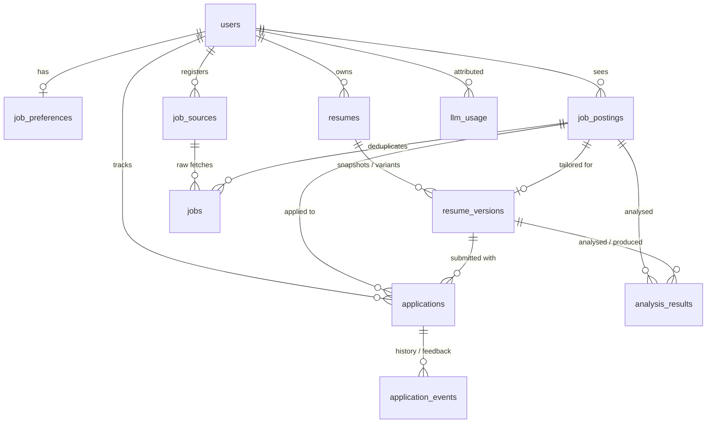

# Data model

The schema behind Career Copilot. Rationale for the shape (two-level jobs,
per-user scoping, JSONB) is in [ADR-0009](adr/0009-data-model-and-job-dedup.md).
Source of truth: `backend/app/models/`. Migrations: `backend/alembic/versions/`.

Every table has `id` (UUID, `gen_random_uuid()`), `created_at`, `updated_at`
(both `timestamptz`, DB defaults). Every domain table carries `user_id` for
scoping; deletes cascade from `users`.

## ER diagram

## Tables

### Identity & preferences

| table | purpose | key columns |
|---|---|---|
| `users` | account | `email` (unique), `password_hash` (argon2), `email_verified_at` |
| `job_preferences` | one per user | `desired_roles[]`, `locations[]`, `employment_types[]`, `salary_min/max`, `remote_required`, `target_start` |

### Résumés

| table | purpose | key columns |
|---|---|---|
| `resumes` | container, usually one primary per user | `label`, `is_primary` |
| `resume_versions` | immutable snapshot: evolving base + per-job tailored variants | `version_no` (unique per resume), `source` (`upload`/`form`/`llm_extract`/`tailored`), `tailored_for_job_posting_id`, `raw_text`, `structured` (JSONB), `source_file_key` (S3) |

### Jobs (ADR-0009)

| table | purpose | key columns |
|---|---|---|
| `job_sources` | a career URL to crawl | `url` (unique per user), `status`, resolved route: `source_type` (`ats`/`json_ld`/`llm`), `ats_vendor`, `ats_board_id`; `robots_state` + `robots_checked_at`; `fetch_interval_hours`, `last_fetched_at`, `last_success_at`, `last_error`, `consecutive_failures` |
| `jobs` | one raw fetch per `(source, external job)` — kept for diffing & provenance | `external_id`, `url`, `source_type`, `ats_vendor`, `raw_text`, `raw_text_hash` (diff gate), `structured` (JSONB), `needs_review`, `match_score`, `first_seen_at`, `last_seen_at`. Unique `(job_source_id, url)`; unique `(job_source_id, external_id)` where set |
| `job_postings` | the deduplicated logical job the user interacts with | `dedup_key` (unique per user), `company_name` + `company_name_normalized`, `canonical_title`, `location_normalized`, `structured` (merged), `status` (`new`/`interested`/`not_interested`/`archived`), `bookmarked`, `match_score` |

### Applications

| table | purpose | key columns |
|---|---|---|
| `applications` | one per `(user, job_posting)` | `status` (`applied` → `screening` → `first_interview` → `final_interview` → `offer` / `rejected` / `withdrawn`), `resume_version_id`, `applied_at`, `next_action_at`, `notes` |
| `application_events` | status history, notes, interview feedback | `kind`, `from_status`, `to_status`, `occurred_at`, `payload` (JSONB) |

### Analysis & cost

| table | purpose | key columns |
|---|---|---|
| `analysis_results` | a gap-analysis or résumé-tailoring run | `kind` (`gap_analysis`/`resume_tailoring`), `status` (`pending`/`running`/`succeeded`/`failed`), `result` (JSONB), `produced_resume_version_id`, `needs_review`, `model`, `error` |
| `llm_usage` | per-call tokens + estimated cost | `purpose`, `model`, `input_tokens`, `output_tokens`, `cost_usd`, `related_kind` + `related_id` (loose link) |

## Enums

Stored as plain `VARCHAR` (`native_enum=False`, no DB `CHECK` — see ADR-0009),
validated in Python by the SQLAlchemy `Enum` type and by Pydantic at the API
edge. Defined in `app/models/enums.py`.

## Structured JSONB

`jobs.structured` / `job_postings.structured` share one shape (the common schema
from ADR-0006): `title`, `required_skills[]`, `preferred_skills[]`,
`salary_min/max`, `locations[]`, `remote`, `employment_type`, `description`.
`resume_versions.structured`: `summary`, `companies[]` (`{name, period, role,
achievements[]}`), `skills[]`. These are validated by Pydantic models at the app
boundary, not by the database.
